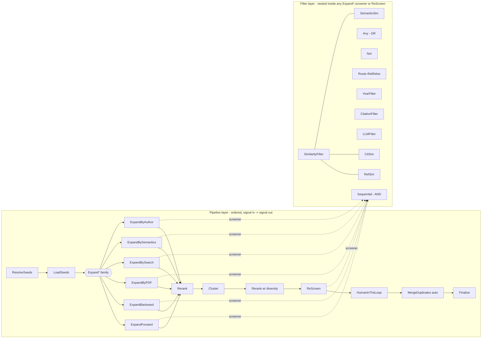

# CiteClaw Foundational Building Blocks

Reference map of every compositional primitive in CiteClaw and how they
fit together. This file exists to answer one question: is the pipeline
truly LEGO-like — can any sequence of steps compose into a working run
as long as each step honours the signal-in / signal-out contract? The
verdict, after auditing every step, filter, measure, clusterer, and
context field: **yes**, with a small set of documented quirks (§8).

## 1. Two compositional layers

```
+---------------------------------------------------------------------+
| Pipeline layer          operates on: signal: list[PaperRecord]      |
|                         composition:  top-level Sequential list,    |
|                                       Parallel                      |
|                         contract:     run(signal, ctx) -> StepResult|
|                                       (src/citeclaw/steps/base.py)  |
+---------------------------------------------------------------------+
| Filter block layer      operates on: one PaperRecord -> bool        |
|                         composition:  Sequential (AND), Any (OR),   |
|                                       Not, Route (if/elif/else)     |
|                         atoms:        YearFilter, CitationFilter,   |
|                                       LLMFilter                     |
|                         measures:     RefSim, CitSim, SemanticSim   |
|                         embedded in:  Expand*.screener, ReScreen    |
+---------------------------------------------------------------------+
```

Steps never run inside filter blocks and filter blocks never run as
steps — the two layers are fully independent. The only coupling
between layers is that every `Expand*` step (and `ReScreen`) accepts
a `screener:` argument whose value is a filter-block subtree.

## 2. The Expand* family — six LEGO blocks on "current signal + topic"

This is the layer that matches the user-facing mental model. Every
primitive below takes the current signal (initially the seeds; later,
whatever the previous step emitted) plus a screener, and returns
survivors on the signal-out port.

```
                        +----------------+
                        | ExpandForward  |   citers of each paper (S2)
                        +----------------+
                        +----------------+
                        | ExpandBackward |   references of each paper (S2)
                        +----------------+
                        +----------------+
 +-------------+        | ExpandByPDF    |   parse full-text PDF, extract
 | Current     |------> |                |   key claims + referenced papers
 | signal      |        +----------------+   (uses LLM + PdfFetcher)
 | (seeds on   |        +----------------+
 |  first step,|------> | ExpandBySearch |   LLM agent drives S2 bulk
 |  otherwise  |        |                |   search; iterative refinement
 |  prev step) |        +----------------+
 |             |        +-------------------+
 | + topic     |------> | ExpandBySemantics |  SPECTER2 kNN via S2
 | description |        +-------------------+  /recommendations
 +-------------+        +----------------+
                        | ExpandByAuthor |   top-K authors of signal ->
                        +----------------+   their papers
                        (all -> screener -> survivors back to signal)
```

| Primitive          | Source axis                              | File                              |
|--------------------|-------------------------------------------|-----------------------------------|
| ExpandForward      | S2 citers of each paper                   | `steps/expand_forward.py:16`       |
| ExpandBackward     | S2 references of each paper               | `steps/expand_backward.py:110`     |
| ExpandByPDF        | PDF full-text: LLM-extracted refs         | `steps/expand_by_pdf.py:63`        |
| ExpandBySearch     | LLM agent driving S2 bulk search          | `steps/expand_by_search.py:58`     |
| ExpandBySemantics  | SPECTER2 kNN (S2 /recommendations)        | `steps/expand_by_semantics.py:53`  |
| ExpandByAuthor     | Top authors of signal -> their papers     | `steps/expand_by_author.py:60`     |

Shared properties, enforced in `steps/_expand_helpers.py`:

- **Idempotency fingerprint**: each Expand* step hashes
  `(step_name, sorted signal paper_ids, step config)` and records it
  in `ctx.searched_signals`. Re-running the same step on the same
  signal is a no-op — this is what makes `Parallel` and
  `--continue-from` safe.
- **Source-less filter contract**: ExpandBySearch, ExpandBySemantics,
  ExpandByAuthor, ExpandByPDF call the screener with
  `FilterContext(source=None)`. `RefSim` and `CitSim` return `None`
  on source-less contexts; `SimilarityFilter.on_no_data` decides
  whether that means pass or reject (default `pass`). Pinned by
  `tests/test_filters_source_less.py`.
- **Fully composable**: the output of any Expand* is itself a signal,
  which means any Expand* can feed any other Expand* (or Rerank, or
  Cluster, or ReScreen). No "expansion has to come first" hidden
  ordering.

## 3. Non-Expand pipeline steps (same level as ExpandBy*)

Every step below implements the same `BaseStep` protocol and appears
in `steps/__init__.py::STEP_REGISTRY` (lines 195-211). "Same level"
means they are all eligible to appear at any position in the
top-level pipeline list.

### Seeding / resolution

| Step           | Role                                                 | File                       |
|----------------|------------------------------------------------------|----------------------------|
| ResolveSeeds   | Resolves `{title: ...}` seeds + sibling preprints    | `steps/resolve_seeds.py:64` |
| LoadSeeds      | Fetches seed metadata, populates `ctx.collection`    | `steps/load_seeds.py:14`    |

### Reranking / rescreening / clustering

| Step       | Role                                                        | File                       |
|------------|-------------------------------------------------------------|----------------------------|
| Rerank     | Score-based top-K (metrics: `citation`, `pagerank`); optional cluster-aware diversity; **functional — does not touch `ctx.collection`** | `steps/rerank.py:15`         |
| ReScreen   | Apply a screener block globally to `ctx.collection`; destructive | `steps/rescreen.py:15`      |
| Cluster    | **First-class step at the same level as ExpandBy*** — runs a clusterer over the signal, stores `ClusterResult` in `ctx.clusters[store_as]`; signal pass-through by default | `steps/cluster.py:52`        |

### Dedup / HITL / Terminal / Control flow

| Step             | Role                                                                                | File                              |
|------------------|-------------------------------------------------------------------------------------|-----------------------------------|
| MergeDuplicates  | Preprint<->published cluster detection + merge; **auto-injected before Finalize**   | `steps/merge_duplicates.py:19`    |
| HumanInTheLoop   | Interactive screener-quality check; non-destructive; may `stop_pipeline`            | `steps/human_in_the_loop.py`      |
| Finalize         | Writes JSON / BibTeX / `citation_network.graphml` / `collaboration_network.graphml` | `steps/finalize.py:139`           |
| Parallel         | Broadcasts a snapshot of the signal to N sub-pipelines; unions by `paper_id` with first-write-wins on source | `steps/parallel.py:9`             |

## 4. Filter layer — blocks, atoms, route predicates, measures

Filters only exist inside an Expand*'s `screener:` argument or inside
a `ReScreen` step. They are a separate compositional vocabulary from
the pipeline layer.

### Composite blocks (`filters/blocks/`)

| Block        | Semantics                                              | File                     |
|--------------|--------------------------------------------------------|--------------------------|
| Sequential   | AND of `layers:`; short-circuit on first reject        | `sequential.py:9`        |
| Any          | OR of `layers:`; short-circuit on first pass           | `any_block.py:9`         |
| Not          | Inverts a single child (`layer:`, singular)            | `not_block.py:9`         |
| Route        | if/elif/else dispatch; each route = `if:` + `pass_to:` | `route.py:19`            |
| SimilarityFilter | Max-of-measures thresholding; `on_no_data:` knob   | `similarity.py:9`        |

### Route predicates (`filters/atoms/predicates.py`)

| Predicate      | Semantics                         |
|----------------|-----------------------------------|
| `venue_in`     | Paper's venue in given list       |
| `cit_at_least` | `citation_count >= N`             |
| `year_at_least`| `year >= N`                       |

### Atoms (terminal decisions, `filters/atoms/`)

| Atom           | Semantics                                                  |
|----------------|------------------------------------------------------------|
| YearFilter     | `year` in `[min, max]`                                      |
| CitationFilter | Citation count vs age * `beta`                              |
| LLMFilter      | LLM yes/no over title / title+abstract / venue / full_text; single-prompt or formula mode (Boolean expression over named sub-queries) |

### Similarity measures (`filters/measures/`)

| Measure      | Score                                                      |
|--------------|------------------------------------------------------------|
| RefSim       | Jaccard reference overlap with source paper                |
| CitSim       | Jaccard citer overlap; `pass_if_cited_at_least:` shortcut  |
| SemanticSim  | Cosine on embeddings (default embedder: S2 SPECTER2)       |

## 5. Clusterers, rerank metrics, diversity

### Clusterers

One registry (`cluster/__init__.py::CLUSTERER_REGISTRY`) shared by
both `Cluster` (as the `algorithm:` arg) and `Rerank` (as inline
`diversity: {type: ..., ...}`).

| Clusterer    | Mechanism                                                             | File                  |
|--------------|-----------------------------------------------------------------------|-----------------------|
| walktrap     | igraph `community_walktrap`; targets fixed `n_communities`            | `cluster/walktrap.py:18`     |
| louvain      | igraph `community_multilevel`; auto N                                 | `cluster/louvain.py:18`      |
| topic_model  | UMAP + HDBSCAN over SPECTER2 embeddings (needs `citeclaw[topic_model]`) | `cluster/topic_model.py:37` |

### Cluster naming modes (`Cluster` step's `naming:` arg)

| Mode    | Pipeline                                                               |
|---------|------------------------------------------------------------------------|
| none    | IDs only                                                               |
| tfidf   | c-TF-IDF (BERTopic formula) keywords per cluster                       |
| llm     | LLM-generated label + summary using representative papers              |
| both    | Run tfidf AND llm pipelines                                            |

### Rerank metrics (`rerank/metrics.py:9`)

- `citation` — `paper.citation_count`
- `pagerank` — PageRank over the induced citation graph

### Rerank diversity (`rerank/diversity.py:21`)

- `None` — plain top-K
- `{cluster: "<store_as>"}` — reuse a named `ClusterResult` from a
  prior `Cluster` step
- `{type: "walktrap", ...}` — build a clusterer inline
- Allocator: floor-then-proportional (one slot per cluster first,
  then surplus in proportion to cluster size)

## 6. Context — state shared between steps

All coupling that isn't visible in the signal contract lives on
`Context` (`src/citeclaw/context.py:41-134`). This table is the
reader/writer cross-reference — it is what makes **some** step
orderings mandatory even though `BaseStep` itself has no constraints.

| Field                 | Purpose                                   | Writers                                                                       | Readers                                                  |
|-----------------------|-------------------------------------------|-------------------------------------------------------------------------------|----------------------------------------------------------|
| `collection`          | accepted papers so far                    | LoadSeeds, all ExpandBy*, ReScreen, MergeDuplicates                           | Rerank, Cluster, ReScreen, MergeDuplicates, Finalize     |
| `seen`                | frontier dedup                            | LoadSeeds, all ExpandBy*                                                      | all ExpandBy*                                            |
| `rejected`            | rejected-by-screener dedup                | filter runner, ReScreen                                                       | ExpandBySemantics (optional `use_rejected_as_negatives`) |
| `expanded_forward`    | memoize per-source ExpandForward          | ExpandForward                                                                 | ExpandForward                                            |
| `expanded_backward`   | memoize per-source ExpandBackward         | ExpandBackward                                                                | ExpandBackward                                           |
| `searched_signals`    | fingerprint idempotency for ExpandBy*     | ExpandBySearch / Semantics / Author / PDF                                     | same                                                     |
| `clusters`            | `ClusterResult` by name                   | Cluster                                                                       | Rerank (diversity), Finalize                             |
| `rejection_ledger`    | per-paper rejection reasons               | filter runner                                                                 | HumanInTheLoop                                           |
| `rejection_counts`    | rejection reason tally                    | filter runner, ReScreen, MergeDuplicates                                      | dashboard / telemetry                                    |
| `resolved_seed_ids`   | seeds resolved from titles/siblings       | ResolveSeeds                                                                  | LoadSeeds                                                |
| `alias_map`           | preprint -> published canonical mapping   | MergeDuplicates                                                               | Finalize                                                 |
| `edge_meta`           | per-edge S2 citation metadata             | ExpandForward, ExpandBackward                                                 | Finalize                                                 |

### Ordering constraints that fall out of this table

1. `ResolveSeeds` must precede `LoadSeeds` if used.
2. `LoadSeeds` (or at least something that populates `ctx.collection`)
   must precede any `Expand*`.
3. `Cluster` must precede any `Rerank` that uses
   `diversity: {cluster: ...}` against a pre-named cluster.
4. `MergeDuplicates` is auto-injected before `Finalize` when absent.
5. Everything else is genuinely interchangeable.

## 7. Full topology (Mermaid)



The dashed edges are **configuration**, not data flow: the filter
block tree is passed into each `Expand*` step as the `screener:` arg
at YAML-load time.

## 8. Known compositional quirks

These are not bugs — they are the places where "any order works"
breaks down in practice, so they are worth remembering.

1. **Parallel first-write-wins on duplicate papers.** If two branches
   discover the same `paper_id` from different `source` axes, the
   first branch's record keeps its source. `steps/parallel.py:37`
   uses `merged.setdefault(pid, p)`. Downstream provenance analyses
   should not assume either winner.
2. **Source-less SimilarityFilter degradation.** ExpandBySearch,
   ExpandBySemantics, ExpandByAuthor, and ExpandByPDF pass
   `FilterContext(source=None)`. `RefSim` and `CitSim` both return
   `None` in that case; if every measure is `None`, `on_no_data`
   decides (default `pass`). Easy to accidentally over-accept if
   you reuse a screener originally tuned for ExpandForward.
3. **SearchedSignals fingerprint depends on signal contents.** A
   `Rerank` between two `ExpandBy*` calls changes the downstream
   signal and therefore changes the fingerprint — the second call
   re-runs instead of hitting the idempotency cache. Intended, but
   can surprise users who expect "same config = no re-run".
4. **`MergeDuplicates` auto-injection.** If you explicitly list it
   in a multi-iteration pipeline, it runs twice.
5. **HumanInTheLoop is non-destructive.** Even when a human rejects
   papers at the checkpoint, the signal is returned unchanged — the
   judgments are only used for the per-filter agreement report and
   for the `stop_pipeline` flag.

## 9. Registries at a glance

| Registry                               | Location                                   | Dispatch        |
|----------------------------------------|--------------------------------------------|-----------------|
| `STEP_REGISTRY`                        | `steps/__init__.py:195-211`                | pipeline step  |
| filter block builder                   | `filters/builder.py:57-116`                | filter subtree |
| route predicate registry               | `filters/builder.py` + `atoms/predicates.py` | `if:` dispatch |
| `MEASURE_TYPES`                        | `filters/measures/__init__.py`             | SimilarityFilter measures |
| `CLUSTERER_REGISTRY`                   | `cluster/__init__.py:19-23`                | Cluster + Rerank diversity |
| Rerank metrics                         | `rerank/metrics.py:9`                      | `metric:` arg  |
| LLM client routing                     | `clients/llm/factory.py:build_llm_client`  | `model:` arg   |
| Embedding backend factory              | `clients/embeddings/factory.py`            | `embedder:` arg |
